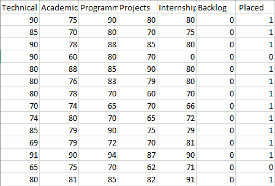
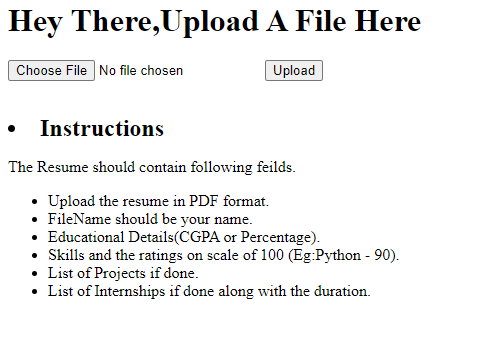

# Employee-Rocommendation-System
Employee Recommendation System using Machine learning and NLP to screen the resumes and predict suitable candidates.

**Description:** 
In most of the organizationss, the employees are selected based on resumes which are manually analyzed and compared with other resumes which increases the use of manpower and utilizes a lot of time. To overcome this problem,Employee Recommendation System can be used. It will collect all the resumes, analyze the resumes based on certain parameter, and then give the best possible set of Employees which are eligible for the organization.   

**Steps:** 
1)Create 'upload' and 'Selected_Candidates' folders. 
2)start the resumeupload.js file using command "node resumeupload.js" 
3)Open Browser and run localhost:3000 
4)Upload the resumes there as PDF files whilch will be saved to the upload folder. 
5)Run the algorithm.ipynb file. 
6)The selected candidates resume will appear in Selected_Candidates folder.  

**Installation** 
1)Install nodeJS to be able to run resumeupload.js 
2)Install any one WAMP,XAMPL or LAMP server   

**ScreenShots:** 
1)Dataset: 
 
2)Website to upload image 
  

## Authors
- [Sayali Pawar](https://github.com/sayaliipawar)

